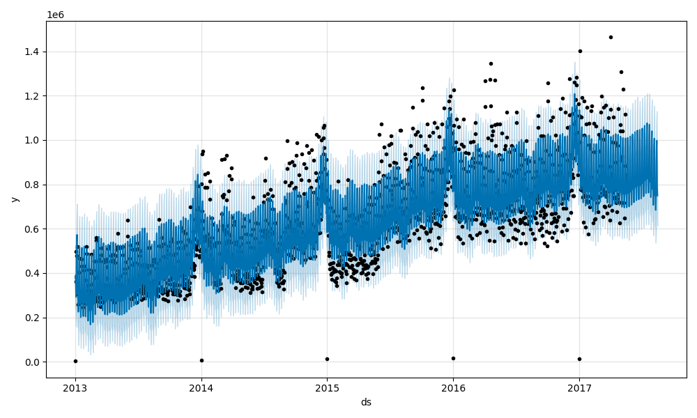
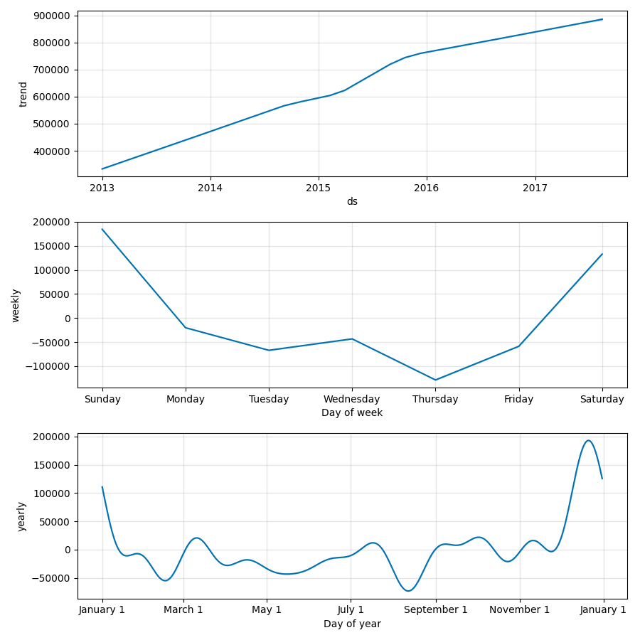
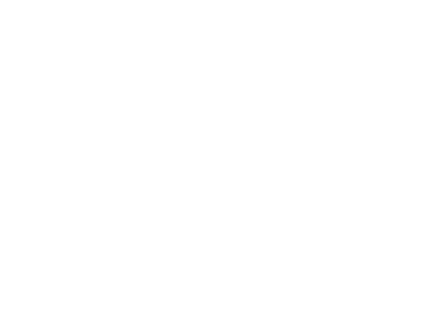

# 📈 Demand Forecasting for Retail using Prophet

## Overview

Demand forecasting is a critical task in retail analytics that helps businesses optimize inventory, reduce stockouts, and improve supply chain efficiency.

This project uses historical retail sales data and Facebook Prophet, a powerful time-series forecasting library, to predict future sales trends. Additional features such as promotions, transactions, and oil prices were incorporated to improve forecasting quality.

---

## Problem Statement

Retail businesses often struggle with inventory planning due to fluctuating customer demand.

The objective of this project is to:

* Forecast future product demand using historical sales data.
* Analyze seasonal and trend patterns.
* Support inventory optimization and business decision-making.

---

## Dataset

Dataset: **Store Sales - Time Series Forecasting**

Files Used:

* train.csv
* transactions.csv
* oil.csv
* stores.csv
* holidays_events.csv

### Key Features

| Feature          | Description                     |
| ---------------- | ------------------------------- |
| date             | Sales date                      |
| sales            | Total sales (Target Variable)   |
| onpromotion      | Number of items under promotion |
| transactions     | Customer transaction count      |
| dcoilwtico       | Daily oil price                 |
| year, month, day | Time-based features             |
| dayofweek        | Day of week                     |
| is_weekend       | Weekend indicator               |

---

## Project Workflow

### 1. Data Collection

Loaded retail sales data and supporting datasets including transactions and oil prices.

### 2. Data Cleaning

* Converted date columns to datetime format
* Handled missing oil prices using forward fill and backward fill
* Filled missing transaction values
* Merged multiple datasets into a unified forecasting dataset

### 3. Exploratory Data Analysis (EDA)

Performed analysis to identify:

* Sales trends
* Seasonal patterns
* Weekly demand fluctuations
* Impact of promotions and external factors

### 4. Feature Engineering

Created additional features:

* Year
* Month
* Day
* Day of Week
* Weekend Indicator

### 5. Forecasting

Implemented Facebook Prophet with:

* Yearly Seasonality
* Weekly Seasonality
* Trend Detection

### 6. Model Evaluation

Evaluated model performance using:

* Root Mean Squared Error (RMSE)
* Mean Absolute Percentage Error (MAPE)

---

## Model Performance

### RMSE

```text
94,348.20
```

### MAPE

```text
8.26%
```

### Performance Interpretation

A MAPE of **8.26%** indicates that the model's predictions differ from actual sales by only about 8% on average, representing excellent forecasting performance for retail demand prediction.

---

## Results

The model successfully captured:

✅ Long-term sales trends

✅ Weekly seasonality patterns

✅ Demand fluctuations over time

✅ Future sales forecasts for the next 90 days

The forecast closely follows actual sales values and demonstrates strong predictive capability.

---

## Visualizations

### Forecasted Sales



### Seasonality Components



### Actual vs Predicted Sales



---

## Technologies Used

* Python
* Pandas
* NumPy
* Matplotlib
* Scikit-learn
* Prophet
* Jupyter Notebook

---

## Project Structure

```text
Demand-Forecasting-Retail/
│
├── data/
│   ├── train.csv
│   ├── test.csv
│   ├── stores.csv
│   ├── holidays_events.csv
│   ├── oil.csv
│   ├── transactions.csv
│   ├── sample_submission.csv
│   ├── processed_sales_data.csv
│   └── predictions.csv
│
├── images/
│   ├── forecast_plot.png
│   ├── seasonality_components.png
│   └── actual_vs_predicted.png
│
├── models/
│   └── prophet_model.pkl
│
├── demand_forecasting.ipynb
├── requirements.txt
└── README.md
```

---

## Future Improvements

* Incorporate holiday effects directly into forecasting
* Build LSTM-based deep learning forecasting models
* Forecast demand at product-category level
* Develop a Streamlit or Flask dashboard
* Deploy forecasting model as a web application

---

## Conclusion

This project demonstrates the application of time-series forecasting techniques for retail demand prediction. By leveraging Facebook Prophet and engineered features, the model achieved strong forecasting performance with a MAPE of 8.26%.

The project showcases practical skills in:

* Data Cleaning
* Feature Engineering
* Time-Series Forecasting
* Model Evaluation
* Data Visualization

making it a valuable portfolio project for Data Science and Analytics roles.

---

## Author

**Ajinkya Mariche**

Data Science Intern Project

GitHub: *Add your GitHub profile link here*
